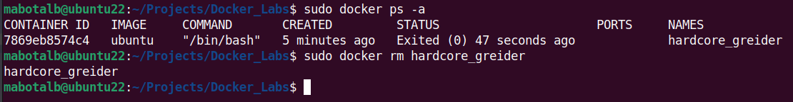

# ITI - Docker Lab 🐋

## Task 1: Working with Docker Hello-world Image

### Objective

Learn how to run a container using the hello-world image and manage containers and images.

### Steps

#### 1. Run a Container with hello-world Image

```bash
docker pull hello-world
docker run hello-world
```


#### 2. Check Container Status and Explain

```bash
show running images
=> docker ps
show all running and stopped images
=> docker ps -a
```


#### 3. Start the Stopped Container

```bash
docker run hello-world
```


#### 4. Remove the Container

```bash
docker rm frosty_albattani
```


#### 5. Remove the Image

```bash
docker rmi hello-world
```


---

## Task 2: Running Container with Ubuntu Image

### Objective

Run an Ubuntu container in interactive mode, create a file inside it, and manage containers.

### Steps

#### 1. Run Ubuntu Container in Interactive Mode

```bash
docker run -it ubuntu
```

#### 2. Create a File inside the Container

```bash
touch hello-docker
```


#### 3. Stop and Remove the Container

```bash
exit
docker rm hardcore_greider
```



#### 4. Check File Status

```bash
ls -l hello-docker
```

#### 5. What happened to hello-docker file?

`When we stop and remove the container, the container's filesystem, including any files you created within it (such as hello-docker), is deleted.`

#### 6. Remove All Stopped Containers

```bash
docker container prune
```

#### 7. Bonus: Remove All Containers in One Command

```bash
docker rm -f $(docker ps -a -q)
```

---

## Task 3: Creating a Custom Nginx Docker Image

### Objective

Create a custom Docker image using Nginx and a local HTML file.

### Steps

#### 1. Create a Local HTML File

```bash
touch index.html
```

#### 2. Write Dockerfile and Copy the HTML file to the Docker Image

```bash
FROM nginx:alpine

COPY index.html /usr/share/nginx/html/index.html
```

#### 3. Run Container with New Image

```bash
docker run -d -p 8088:80 nginx-mabotalb
```

#### 4. Test the Container, open your browser and navigate to <http://localhost:8088> to check if everything is okay


