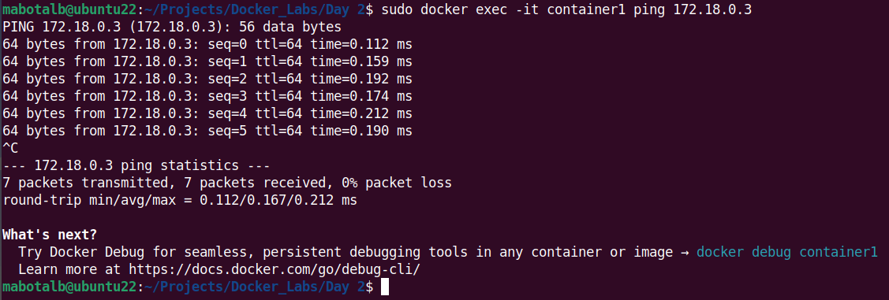

# ITI - Docker Lab2 🐋

## Task 1

Run a container using nginx image, and mount a directory from your host into the
Docker container. example: /home/samy/nginx:/home/nginx (bind mount)

```bash
docker run -d -p 8080:80 -v /home/mabotalb/nginx:/home/nginx nginx
```


---

## Task 2

### Steps

#### 1. Create 2 docker network (net-1 & net-2)

```bash
docker network create net-1
docker network create net-2
```


#### 2. Run 2 new containers using nginx:alpine image, and attach the net-1 to them

```bash
docker run -d --name container1 --network net-1 nginx:alpine
docker run -d --name container2 --network net-1 nginx:alpine
```


#### 3. Run another 1 new containers using nginx:alpine image, and attach the net-2 to them

```bash
docker run -d --name container3 --network net-2 nginx:alpine
```


#### 4. Inspect the 3 containers to know their IPs and write them aside

```bash
docker inspect -f '{{range .NetworkSettings.Networks}}{{.IPAddress}}{{end}}' container1
docker inspect -f '{{range .NetworkSettings.Networks}}{{.IPAddress}}{{end}}' container2
docker inspect -f '{{range .NetworkSettings.Networks}}{{.IPAddress}}{{end}}' container3
```


#### 5. Enter a container in the net-1 network and try to ping a container in the net-2 network (What do you notice?)

```bash
docker exec -it container1 ping 172.19.0.2
```


#### 6. Enter a container in the net-1 network and try to ping the other container in the same network (What do you notice?)

```bash
docker exec -it container1 ping 172.18.0.3
```



---

## Task 3: Explain the difference between Docker volumes and Bind Mount

### Docker volumes

- It is the recommended method for storing data created and utilized by Docker containers is to use volumes.
- Volumes may be managed via the Docker API or Docker CLI commands.

### Bind Mount

- It relies on the host machine’s operating system and directory structure. Bind mounts are more difficult to transfer or backup than volumes.
- A file or directory on the host computer gets mounted into a container when you use bind mount.
